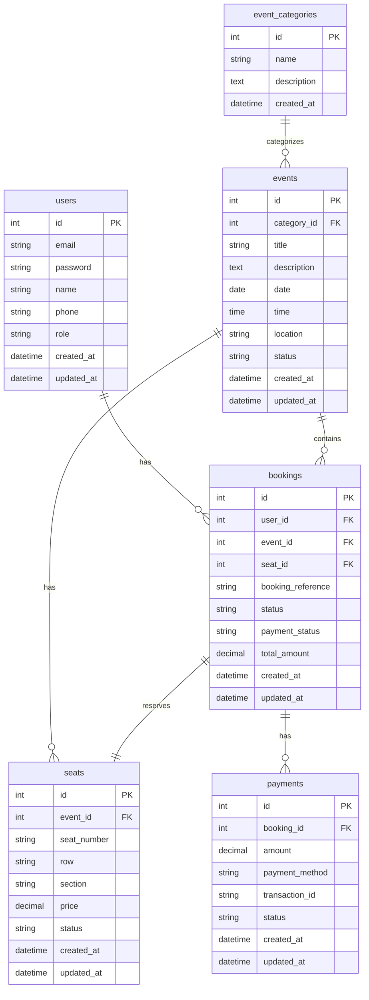
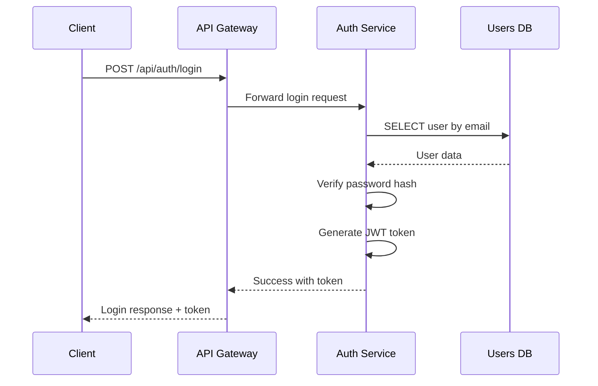
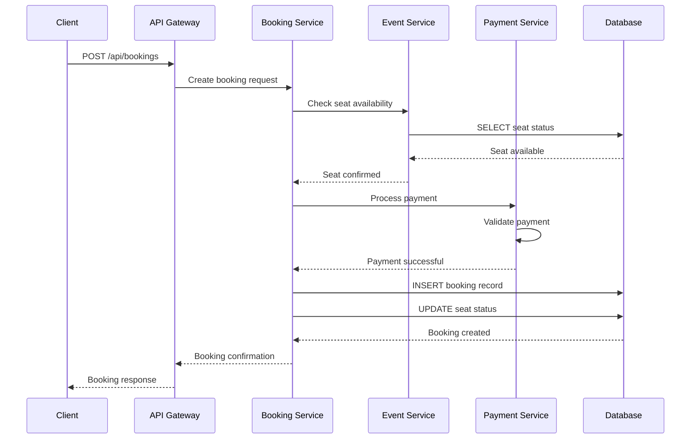
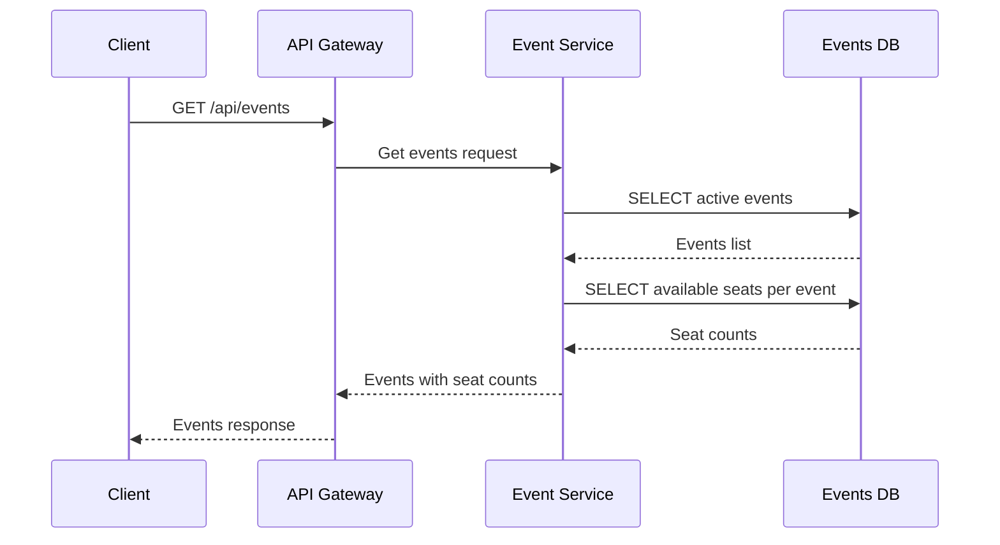
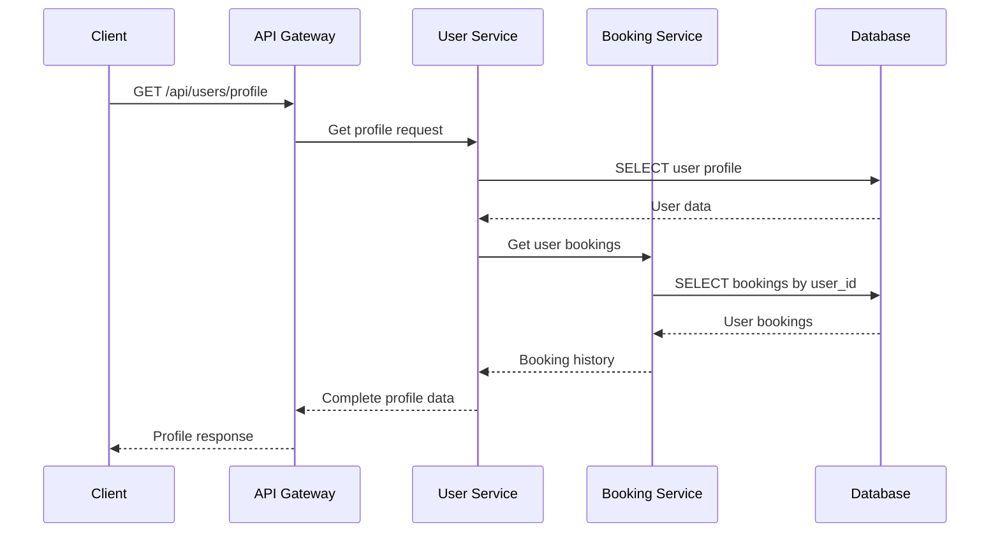

# API & Database Workflow Documentation

## Database Schema Visualization



## API Flow Architecture

```mermaid
graph TD
    subgraph "Client Layer"
        A[Frontend App]
        B[Mobile App]
    end
    
    subgraph "API Gateway"
        C[API Gateway]
    end
    
    subgraph "Authentication Service"
        D[/api/auth/login]
        E[/api/auth/register]
        F[/api/auth/refresh]
    end
    
    subgraph "Event Service"
        G[/api/events]
        H[/api/events/{id}]
        I[/api/events/{id}/seats]
    end
    
    subgraph "Booking Service"
        J[/api/bookings]
        K[/api/bookings/{id}]
        L[/api/bookings/user/{user_id}]
    end
    
    subgraph "User Service"
        M[/api/users/profile]
        N[/api/users/{id}]
        O[/api/users/{id}/bookings]
    end
    
    subgraph "Payment Service"
        P[/api/payments]
        Q[/api/payments/{id}]
    end
    
    subgraph "Database Layer"
        R[(Users DB)]
        S[(Events DB)]
        T[(Bookings DB)]
        U[(Payments DB)]
    end
    
    A --> C
    B --> C
    C --> D
    C --> E
    C --> F
    C --> G
    C --> H
    C --> I
    C --> J
    C --> K
    C --> L
    C --> M
    C --> N
    C --> O
    C --> P
    C --> Q
    
    D --> R
    E --> R
    F --> R
    G --> S
    H --> S
    I --> S
    J --> T
    K --> T
    L --> T
    M --> R
    N --> R
    O --> R
    P --> U
    Q --> U
    
    style A fill:#4CAF50
    style B fill:#4CAF50
    style C fill:#2196F3
    style D fill:#FF9800
    style E fill:#FF9800
    style F fill:#FF9800
    style G fill:#9C27B0
    style H fill:#9C27B0
    style I fill:#9C27B0
    style J fill:#F44336
    style K fill:#F44336
    style L fill:#F44336
    style M fill:#607D8B
    style N fill:#607D8B
    style O fill:#607D8B
    style P fill:#795548
    style Q fill:#795548
```

## API Endpoint Detailed Flows

### 1. Authentication Flow



### 2. Booking Creation Flow



### 3. Event Listing Flow



### 4. User Profile Flow



## Database Operations by API

### /api/auth/login
- **Tables**: `users`
- **Operations**: 
  ```sql
  SELECT id, email, password, name, role, phone 
  FROM users 
  WHERE email = ? AND password = ?
  ```

### /api/bookings
- **Tables**: `seats`, `events`, `users`, `bookings`
- **Operations**:
  ```sql
  -- Check seat availability
  SELECT id, seat_number, row, section, price, status 
  FROM seats 
  WHERE id = ? AND status = 'available'
  
  -- Verify event
  SELECT id, title, date, time, location 
  FROM events 
  WHERE id = ? AND status = 'active'
  
  -- Create booking
  INSERT INTO bookings (user_id, event_id, seat_id, booking_reference, status, total_amount)
  VALUES (?, ?, ?, ?, 'pending', ?)
  
  -- Update seat status
  UPDATE seats 
  SET status = 'booked' 
  WHERE id = ?
  ```

### /api/events
- **Tables**: `events`, `seats`
- **Operations**:
  ```sql
  -- Get active events
  SELECT id, title, description, date, time, location, status
  FROM events 
  WHERE status = 'active' AND date >= CURRENT_DATE
  
  -- Count available seats
  SELECT event_id, COUNT(id) as available_seats
  FROM seats 
  WHERE status = 'available'
  GROUP BY event_id
  ```

### /api/users/profile
- **Tables**: `users`, `bookings`, `events`, `seats`
- **Operations**:
  ```sql
  -- Get user profile
  SELECT id, name, email, phone, role, created_at
  FROM users 
  WHERE id = ?
  
  -- Get booking history
  SELECT b.id, b.booking_reference, b.status, b.payment_status, b.total_amount, b.created_at,
         e.title, e.date, e.time, e.location,
         s.seat_number, s.row, s.section
  FROM bookings b
  LEFT JOIN events e ON b.event_id = e.id
  LEFT JOIN seats s ON b.seat_id = s.id
  WHERE b.user_id = ?
  ORDER BY b.created_at DESC
  ```

## Swagger Documentation Integration

### OpenAPI 3.0 Structure
```yaml
openapi: 3.0.0
info:
  title: Ticket Booking API
  version: 1.0.0
  description: API for event ticket booking system

paths:
  /api/auth/login:
    post:
      summary: User authentication
      requestBody:
        required: true
        content:
          application/json:
            schema:
              type: object
              properties:
                email:
                  type: string
                password:
                  type: string
      responses:
        '200':
          description: Login successful
          content:
            application/json:
              schema:
                type: object
                properties:
                  token:
                    type: string
                  user:
                    $ref: '#/components/schemas/User'

  /api/bookings:
    post:
      summary: Create new booking
      requestBody:
        required: true
        content:
          application/json:
            schema:
              type: object
              properties:
                user_id:
                  type: integer
                event_id:
                  type: integer
                seat_id:
                  type: integer
      responses:
        '201':
          description: Booking created
          content:
            application/json:
              schema:
                $ref: '#/components/schemas/Booking'

components:
  schemas:
    User:
      type: object
      properties:
        id:
          type: integer
        email:
          type: string
        name:
          type: string
        phone:
          type: string
        role:
          type: string
    
    Booking:
      type: object
      properties:
        id:
          type: integer
        booking_reference:
          type: string
        status:
          type: string
        total_amount:
          type: number
        user:
          $ref: '#/components/schemas/User'
        event:
          $ref: '#/components/schemas/Event'
        seat:
          $ref: '#/components/schemas/Seat'
```

## Usage Instructions

### 1. Install VS Code Extensions
```bash
# Install in VS Code Extensions Marketplace
1. Markdown Preview Mermaid Support (bierner.markdown-mermaid)
2. Mermaid Chart (Mermaid-Chart.vscode-mermaid-chart)
3. dbdiagram.io (dbdiagram.dbdiagram-vscode)
```

### 2. View Diagrams
1. Open this file in VS Code
2. Use `Ctrl+Shift+V` to open Markdown Preview
3. Diagrams will render automatically
4. Use mouse to pan and zoom diagrams

### 3. Edit Diagrams
1. Modify mermaid code blocks
2. Save file (`Ctrl+S`)
3. Preview updates automatically
4. AI can help generate/update mermaid code

### 4. Integration with Development
- Use these diagrams as documentation
- Update when API changes
- Keep in sync with database schema
- Share with team via Git

This documentation provides a complete visual representation of your API and database architecture that both AI and humans can understand and work with together.
