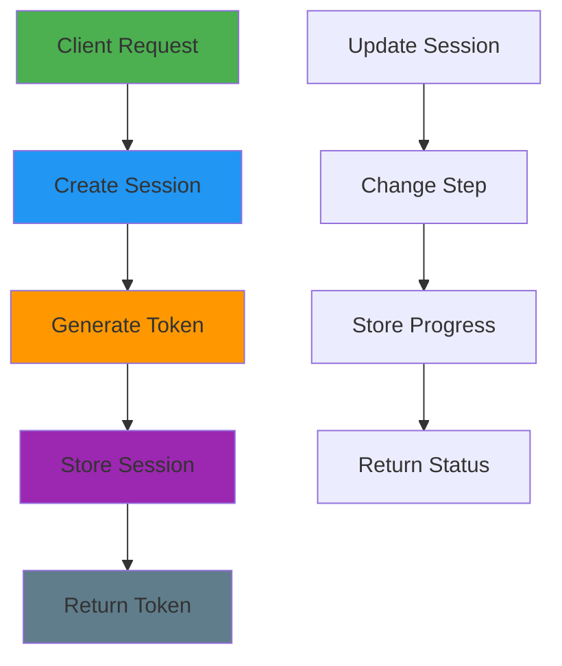
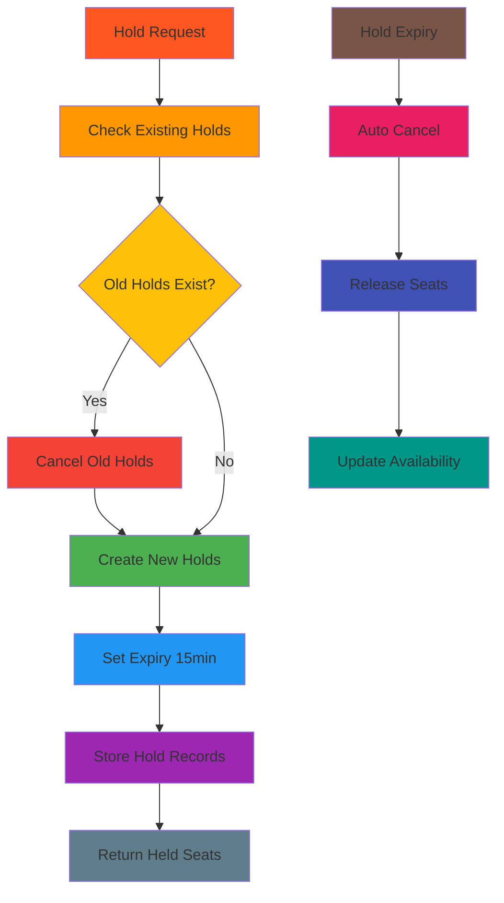
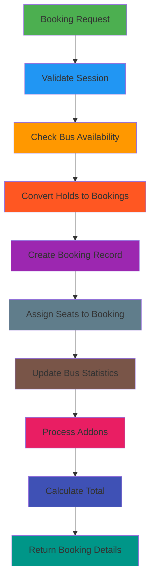

# Booking System Workflow Documentation

## Database Schema from Prisma

### Core Tables

```mermaid
erDiagram
    User ||--o{ Booking : "books"
    BusRound ||--o{ Booking : "contains"
    BusRound ||--o{ SeatBooking : "has seats"
    Booking ||--o{ SeatBooking : "reserves"
    Booking ||--|| Payment : "has"
    SeatBooking ||--|| InsuranceForm : "requires"
    Booking ||--o{ BookingAddon : "includes"
    Addon ||--o{ BookingAddon : "offered"
    Trip ||--o{ BusRound : "has rounds"
    Trip ||--o{ Addon : "offers"
    User ||--o{ Payment : "pays"
    
    User {
        int id PK
        string username UK
        string password
        Role role
        string name
        string phone
        string email
        datetime createdAt
        datetime updatedAt
    }
    
    Trip {
        int id PK
        string title
        string description
        string imageUrl
        float price
        float deposit
        boolean isActive
        datetime createdAt
        datetime updatedAt
    }
    
    BusRound {
        int id PK
        int tripId FK
        int busNumber
        string startPoint
        string endPoint
        datetime departDate
        string duration
        int totalSeats
        int bookedSeats
        boolean isOpen
        float extraPrice
        json pickupPoints
        datetime createdAt
        datetime updatedAt
    }
    
    Booking {
        int id PK
        int userId FK
        int busRoundId FK
        int seats
        string bookingType
        string foodAllergy
        BookingStatus status
        float totalAmount
        string recordedBy
        datetime createdAt
        datetime updatedAt
    }
    
    SeatBooking {
        int id PK
        int busRoundId FK
        int bookingId FK
        int seatNumber
        int vanOrder
        string namePrefix
        string firstName
        string lastName
        string nickname
        string gender
        string nationalId
        datetime birthDate
        string phone
        string email
        string bloodType
        string idCardImageUrl
        string foodAllergy
        string pickupPoint
        string dropoffPoint
        string emergencyName
        string emergencyPhone
        string sessionToken
        datetime holdExpiresAt
        datetime createdAt
    }
    
    Payment {
        int id PK
        int bookingId FK
        int userId FK
        float amount
        PaymentType type
        string slipUrl
        PaymentStatus status
        datetime confirmedAt
        datetime createdAt
        datetime updatedAt
    }
    
    InsuranceForm {
        int id PK
        int bookingId FK
        int seatBookingId FK
        string beneficiaryName
        string beneficiaryRelation
        float coverageAmount
        boolean consentPolicyRead
        boolean consentTermsAccepted
        boolean consent4WD
        boolean consentDomesticOnly
        string status
        string submittedAt
        string reviewedBy
        datetime reviewedAt
        string rejectReason
        string issuedPolicyNo
        datetime createdAt
        datetime updatedAt
    }
    
    BookingSession {
        int id PK
        string token UK
        int busRoundId FK
        int step
        string selectedSeats
        datetime createdAt
        datetime updatedAt
    }
    
    Addon {
        int id PK
        int tripId FK
        string name
        string description
        float price
        boolean isActive
    }
    
    BookingAddon {
        int id PK
        int bookingId FK
        int addonId FK
        int quantity
        float price
    }
```


## Complete Booking Flow with Hold System

```mermaid
sequenceDiagram
    participant Client
    participant API as API Gateway
    participant Session as Booking Session
    participant Seats as Seat Service
    participant Bus as BusRound Service
    participant DB as Database
    
    Note over Client,DB: Step 1: Start Booking Session
    Client->>API: POST /booking-sessions
    API->>Session: Create session token
    Session->>DB: INSERT BookingSession(token, step=1)
    DB-->>Session: Session created
    Session-->>API: Session token
    API-->>Client: {token, step: 1}
    
    Note over Client,DB: Step 2: Hold Seats
    Client->>API: POST /seat-bookings/hold
    Note over API: Request: {sessionToken, busRoundId, seats: [1,2,3]}
    
    API->>Seats: Check existing holds
    Seats->>DB: SELECT SeatBooking WHERE sessionToken=? AND holdExpiresAt > NOW()
    DB-->>Seats: Existing holds found
    
    alt Existing holds exist
        Seats->>DB: DELETE old holds
        DB-->>Seats: Old holds cancelled
    end
    
    API->>Seats: Create new holds
    Seats->>DB: INSERT SeatBooking(sessionToken, seatNumber, holdExpiresAt=NOW+15min)
    DB-->>Seats: Holds created
    Seats-->>API: {heldSeats: [1,2,3], expiresAt}
    API-->>Client: Seats held successfully
    
    Note over Client,DB: Step 3: Update Session Step
    API->>Session: UPDATE step=2
    Session->>DB: UPDATE BookingSession SET step=2
    DB-->>Session: Updated
    Session-->>API: Step updated
    
    Note over Client,DB: Step 4: Fill Passenger Details
    Client->>API: PUT /seat-bookings/details
    Note over API: Request: {sessionToken, passengers: [{seatNumber, firstName, lastName, phone,...}]}
    
    API->>Seats: Update passenger info
    Seats->>DB: UPDATE SeatBooking SET firstName=?, lastName=?, phone=?,...
    DB-->>Seats: Updated
    Seats-->>API: Passenger details saved
    
    Note over Client,DB: Step 5: Create Booking
    Client->>API: POST /bookings
    Note over API: Request: {sessionToken, bookingType, addons}
    
    API->>Bus: Check availability
    Bus->>DB: SELECT BusRound WHERE id=? AND isOpen=true
    DB-->>Bus: BusRound available
    
    API->>Seats: Convert holds to bookings
    Seats->>DB: 
        1. INSERT Booking(userId, busRoundId, status=PENDING)
        2. UPDATE SeatBooking SET bookingId=?, sessionToken=NULL
        3. UPDATE BusRound SET bookedSeats=bookedSeats+seats
    DB-->>Seats: Booking created, seats assigned
    Seats-->>API: {bookingId, bookingReference}
    
    alt Addons selected
        API->>DB: INSERT BookingAddon(bookingId, addonId, quantity, price)
        DB-->>API: Addons added
    end
    
    Note over Client,DB: Step 6: Update Session Step
    API->>Session: UPDATE step=3
    Session->>DB: UPDATE BookingSession SET step=3
    DB-->>Session: Updated
    Session-->>API: Step updated
    
    API-->>Client: {bookingId, bookingReference, totalAmount, step: 3}
    
    Note over Client,DB: Step 7: Payment Processing
    Client->>API: POST /payments
    Note over API: Request: {bookingId, amount, type, slipUrl}
    
    API->>DB: INSERT Payment(bookingId, userId, amount, type, slipUrl, status=PENDING)
    DB-->>API: Payment record created
    
    alt Payment confirmed
        API->>DB: UPDATE Payment SET status=CONFIRMED, confirmedAt=NOW()
        API->>DB: UPDATE Booking SET status=CONFIRMED
        API->>DB: UPDATE BusRound SET bookedSeats=bookedSeats+seats
        DB-->>API: Payment confirmed, booking confirmed
        API-->>Client: {status: CONFIRMED, paymentId}
    else Payment rejected
        API->>DB: UPDATE Payment SET status=REJECTED
        API->>DB: UPDATE Booking SET status=CANCELLED
        API->>DB: UPDATE SeatBooking SET bookingId=NULL
        API->>DB: UPDATE BusRound SET bookedSeats=bookedSeats-seats
        DB-->>API: Payment rejected, booking cancelled
        API-->>Client: {status: REJECTED, reason}
    end
    
    Note over Client,DB: Step 8: Insurance Forms
    Client->>API: POST /insurance-forms
    Note over API: Request: {bookingId, seatBookingId, beneficiaryName,...}
    
    API->>DB: INSERT InsuranceForm(bookingId, seatBookingId, beneficiaryName,...)
    DB-->>API: Insurance form created
    API-->>Client: {insuranceFormId, status: DRAFT}
    
    Note over Client,DB: Step 9: Complete Session
    API->>Session: UPDATE step=4 (completed)
    Session->>DB: UPDATE BookingSession SET step=4
    DB-->>Session: Session completed
    Session-->>API: Session completed
```

## API Endpoints Flow

### 1. Session Management


### 2. Seat Holding System


### 3. Booking Creation


## Database Operations Summary

### Tables Used in Booking Flow:
1. **BookingSession** - Track booking progress
2. **SeatBooking** - Temporary holds + passenger data
3. **Booking** - Main booking records
4. **BusRound** - Trip availability and statistics
5. **Payment** - Payment processing
6. **InsuranceForm** - Insurance requirements
7. **BookingAddon** - Additional services
8. **User** - Customer information

### Key Operations:
- **SELECT**: Check availability, existing holds
- **INSERT**: Create sessions, holds, bookings, payments
- **UPDATE**: Convert holds to bookings, update statistics
- **DELETE**: Cancel expired holds

### Business Logic:
- **15-minute hold expiry** for temporary reservations
- **Step-by-step booking process** (4 steps total)
- **Automatic seat release** on expiry
- **Payment confirmation** triggers final booking
- **Insurance forms** required per passenger

This workflow ensures real-time seat availability management and provides a complete booking experience with proper state tracking and error handling.
