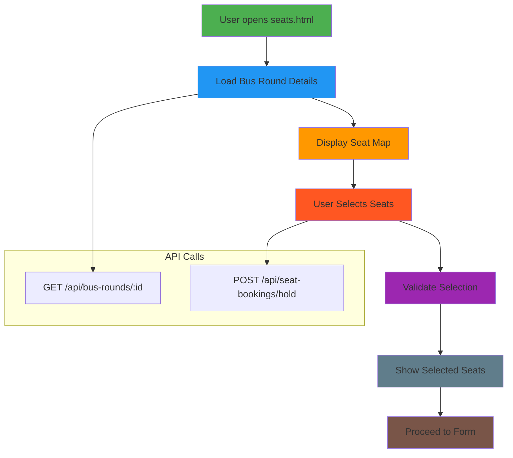
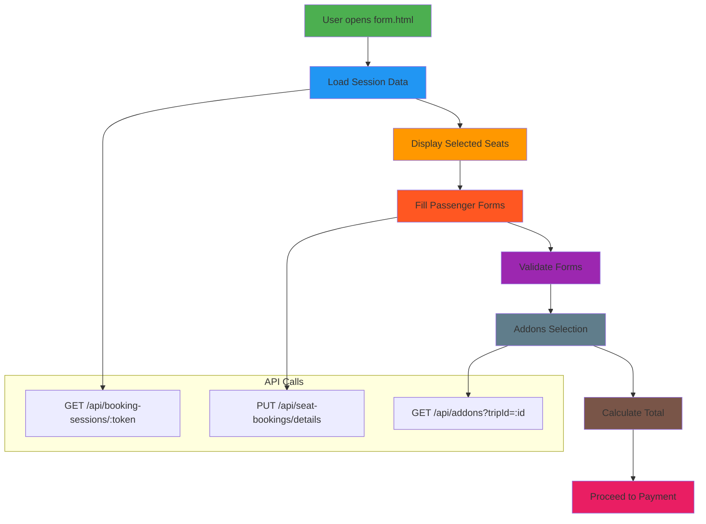
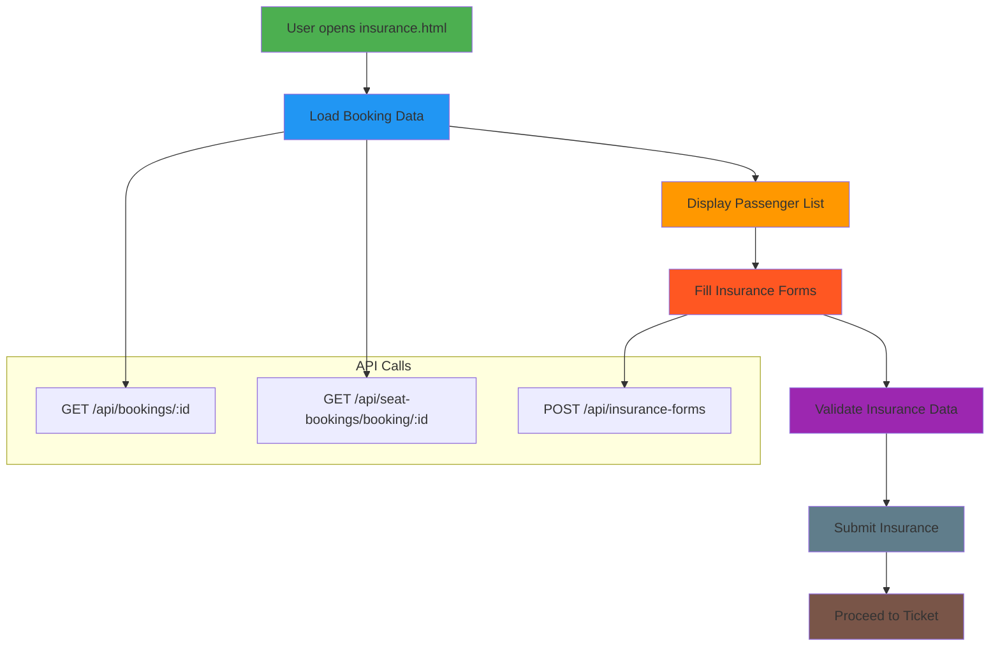
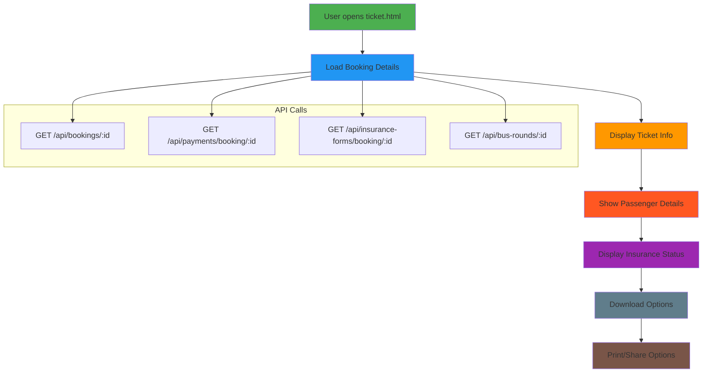
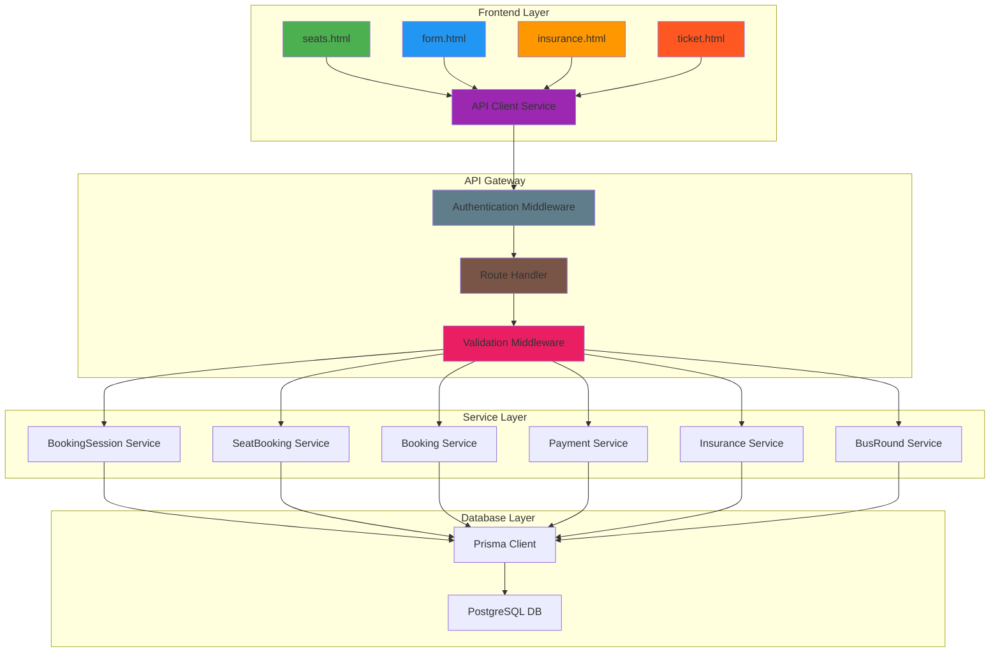
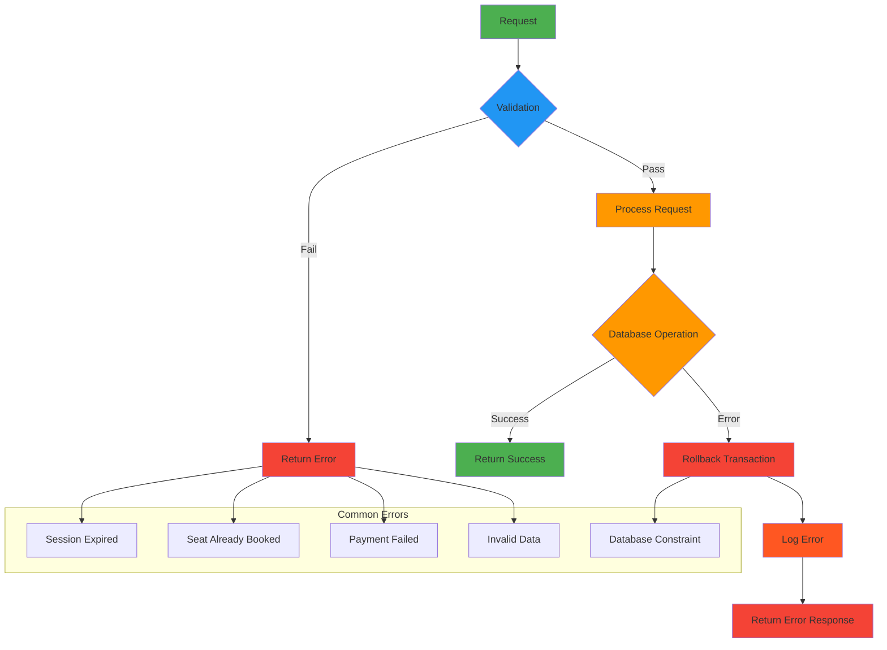
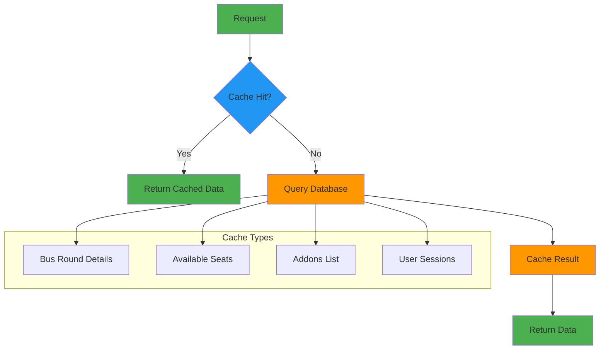

# Complete Booking Flow Documentation

## Overview
Complete end-to-end booking workflow from frontend forms to database storage, including all API interactions and data transformations.

## Frontend Forms Flow

### 1. Seats Selection (seats.html)


### 2. Passenger Form (form.html)


### 3. Insurance Form (insurance.html)


### 4. Ticket Display (ticket.html)


## Complete End-to-End Flow

```mermaid
sequenceDiagram
    participant User
    participant Frontend as Frontend App
    participant API as API Gateway
    participant Session as Booking Session
    participant Seats as Seat Service
    participant Bus as BusRound Service
    participant Booking as Booking Service
    participant Payment as Payment Service
    participant Insurance as Insurance Service
    participant DB as Prisma DB
    
    Note over User,DB: Phase 1: Seat Selection
    User->>Frontend: Open seats.html
    Frontend->>API: GET /api/bus-rounds/:id
    API->>Bus: Get bus round details
    Bus->>DB: SELECT BusRound WHERE id=?
    DB-->>Bus: BusRound data
    Bus-->>API: BusRound with seat map
    API-->>Frontend: BusRound details
    Frontend-->>User: Display seat map
    
    User->>Frontend: Select seats
    Frontend->>Frontend: Validate selection
    Frontend->>API: POST /api/seat-bookings/hold
    API->>Session: Create session token
    Session->>DB: INSERT BookingSession(token, step=1)
    DB-->>Session: Session created
    Session-->>API: Session token
    
    API->>Seats: Hold selected seats
    Seats->>DB: 
        1. Check existing holds
        2. INSERT SeatBooking(sessionToken, seatNumber, holdExpiresAt)
    DB-->>Seats: Seats held
    Seats-->>API: Hold confirmation
    API-->>Frontend: {sessionToken, heldSeats}
    Frontend-->>User: Seats held, proceed to form
    
    Note over User,DB: Phase 2: Passenger Information
    User->>Frontend: Open form.html
    Frontend->>API: GET /api/booking-sessions/:token
    API->>Session: Get session data
    Session->>DB: SELECT BookingSession WHERE token=?
    DB-->>Session: Session data
    Session-->>API: Session details
    API-->>Frontend: Session with selected seats
    Frontend-->>User: Display passenger forms
    
    User->>Frontend: Fill passenger details
    Frontend->>Frontend: Validate forms
    Frontend->>API: PUT /api/seat-bookings/details
    API->>Seats: Update passenger information
    Seats->>DB: UPDATE SeatBooking SET firstName=?, lastName=?, phone=?,...
    DB-->>Seats: Updated
    Seats-->>API: Details saved
    API-->>Frontend: Success
    Frontend->>API: GET /api/addons?tripId=:id
    API->>Bus: Get available addons
    Bus->>DB: SELECT Addon WHERE tripId=? AND isActive=true
    DB-->>Bus: Addons list
    Bus-->>API: Addons data
    API-->>Frontend: Addons
    Frontend-->>User: Display addons, calculate total
    User->>Frontend: Proceed to payment
    
    Note over User,DB: Phase 3: Booking Creation
    Frontend->>API: POST /api/bookings
    API->>Booking: Create booking
    Booking->>Bus: Validate bus round
    Bus->>DB: SELECT BusRound WHERE id=? AND isOpen=true
    DB-->>Bus: BusRound available
    Bus-->>Booking: Validation passed
    
    Booking->>Seats: Convert holds to booking
    Seats->>DB:
        1. INSERT Booking(userId, busRoundId, status=PENDING)
        2. UPDATE SeatBooking SET bookingId=?, sessionToken=NULL
        3. UPDATE BusRound SET bookedSeats=bookedSeats+seats
    DB-->>Seats: Booking created
    Seats-->>Booking: {bookingId, bookingReference}
    
    alt Addons selected
        Booking->>DB: INSERT BookingAddon(bookingId, addonId, quantity, price)
        DB-->>Booking: Addons added
    end
    
    Booking->>Session: UPDATE step=3
    Session->>DB: UPDATE BookingSession SET step=3
    DB-->>Session: Updated
    Booking-->>API: {bookingId, totalAmount}
    API-->>Frontend: Booking created
    Frontend-->>User: Show payment page
    
    Note over User,DB: Phase 4: Payment Processing
    User->>Frontend: Upload payment slip
    Frontend->>API: POST /api/payments
    API->>Payment: Process payment
    Payment->>DB: INSERT Payment(bookingId, userId, amount, slipUrl, status=PENDING)
    DB-->>Payment: Payment record created
    Payment->>Payment: Validate slip
    Payment->>DB: UPDATE Payment SET status=CONFIRMED, confirmedAt=NOW()
    Payment->>DB: UPDATE Booking SET status=CONFIRMED
    Payment-->>API: Payment confirmed
    API-->>Frontend: Payment success
    Frontend-->>User: Proceed to insurance
    
    Note over User,DB: Phase 5: Insurance Forms
    User->>Frontend: Open insurance.html
    Frontend->>API: GET /api/bookings/:id
    API->>Booking: Get booking details
    Booking->>DB: SELECT Booking WHERE id=?
    DB-->>Booking: Booking data
    Booking-->>API: Booking details
    API-->>Frontend: Booking info
    
    Frontend->>API: GET /api/seat-bookings/booking/:id
    API->>Seats: Get seat bookings
    Seats->>DB: SELECT SeatBooking WHERE bookingId=?
    DB-->>Seats: Seat bookings
    Seats-->>API: Passenger list
    API-->>Frontend: Passenger data
    Frontend-->>User: Display insurance forms
    
    User->>Frontend: Fill insurance forms
    Frontend->>API: POST /api/insurance-forms
    API->>Insurance: Create insurance forms
    Insurance->>DB: INSERT InsuranceForm(bookingId, seatBookingId, beneficiaryName,...)
    DB-->>Insurance: Forms created
    Insurance-->>API: Insurance forms saved
    API-->>Frontend: Success
    Frontend-->>User: Proceed to ticket
    
    Note over User,DB: Phase 6: Ticket Display
    User->>Frontend: Open ticket.html
    Frontend->>API: GET /api/bookings/:id
    API->>Booking: Get booking details
    Booking->>DB: SELECT Booking WHERE id=?
    DB-->>Booking: Booking data
    Booking-->>API: Booking info
    
    Frontend->>API: GET /api/payments/booking/:id
    API->>Payment: Get payment details
    Payment->>DB: SELECT Payment WHERE bookingId=?
    DB-->>Payment: Payment data
    Payment-->>API: Payment info
    
    Frontend->>API: GET /api/insurance-forms/booking/:id
    API->>Insurance: Get insurance forms
    Insurance->>DB: SELECT InsuranceForm WHERE bookingId=?
    DB-->>Insurance: Insurance data
    Insurance-->>API: Insurance info
    
    Frontend->>API: GET /api/bus-rounds/:id
    API->>Bus: Get bus round details
    Bus->>DB: SELECT BusRound WHERE id=?
    DB-->>Bus: BusRound data
    Bus-->>API: BusRound info
    
    API-->>Frontend: Complete booking data
    Frontend-->>User: Display complete ticket
```

## API Client Architecture



## Database Operations by Phase

### Phase 1: Seat Selection
```sql
-- Get bus round details
SELECT * FROM BusRound WHERE id = ? AND isOpen = true;

-- Create booking session
INSERT INTO BookingSession (token, busRoundId, step, createdAt)
VALUES (?, ?, 1, NOW());

-- Hold seats
INSERT INTO SeatBooking (busRoundId, seatNumber, sessionToken, holdExpiresAt, createdAt)
VALUES (?, ?, ?, NOW() + INTERVAL '15 minutes', NOW());

-- Check existing holds
SELECT * FROM SeatBooking 
WHERE sessionToken = ? AND holdExpiresAt > NOW();
```

### Phase 2: Passenger Information
```sql
-- Get session data
SELECT * FROM BookingSession WHERE token = ?;

-- Update passenger details
UPDATE SeatBooking 
SET firstName = ?, lastName = ?, phone = ?, email = ?, 
    namePrefix = ?, gender = ?, birthDate = ?, 
    emergencyName = ?, emergencyPhone = ?
WHERE sessionToken = ? AND seatNumber = ?;

-- Get addons
SELECT * FROM Addon WHERE tripId = ? AND isActive = true;
```

### Phase 3: Booking Creation
```sql
-- Create booking
INSERT INTO Booking (userId, busRoundId, seats, bookingType, status, totalAmount, createdAt)
VALUES (?, ?, ?, 'SINGLE', 'PENDING', ?, NOW());

-- Convert holds to booking
UPDATE SeatBooking 
SET bookingId = ?, sessionToken = NULL 
WHERE sessionToken = ?;

-- Update bus statistics
UPDATE BusRound 
SET bookedSeats = bookedSeats + ? 
WHERE id = ?;

-- Add booking addons
INSERT INTO BookingAddon (bookingId, addonId, quantity, price)
VALUES (?, ?, ?, ?);

-- Update session step
UPDATE BookingSession 
SET step = 3 
WHERE token = ?;
```

### Phase 4: Payment Processing
```sql
-- Create payment record
INSERT INTO Payment (bookingId, userId, amount, type, slipUrl, status, createdAt)
VALUES (?, ?, ?, 'FULL', ?, 'PENDING', NOW());

-- Confirm payment
UPDATE Payment 
SET status = 'CONFIRMED', confirmedAt = NOW() 
WHERE id = ?;

-- Confirm booking
UPDATE Booking 
SET status = 'CONFIRMED' 
WHERE id = ?;
```

### Phase 5: Insurance Forms
```sql
-- Create insurance forms
INSERT INTO InsuranceForm (
    bookingId, seatBookingId, beneficiaryName, beneficiaryRelation,
    coverageAmount, consentPolicyRead, consentTermsAccepted,
    consent4WD, consentDomesticOnly, status, createdAt
) VALUES (?, ?, ?, ?, ?, ?, ?, ?, ?, 'DRAFT', NOW());
```

### Phase 6: Ticket Display
```sql
-- Get complete booking data
SELECT 
    b.*, 
    br.*, 
    u.name as userName, 
    u.email as userEmail,
    p.status as paymentStatus,
    p.confirmedAt as paymentConfirmedAt
FROM Booking b
LEFT JOIN BusRound br ON b.busRoundId = br.id
LEFT JOIN User u ON b.userId = u.id
LEFT JOIN Payment p ON b.id = p.bookingId
WHERE b.id = ?;

-- Get passenger details
SELECT 
    sb.*, 
    ins.status as insuranceStatus,
    ins.submittedAt as insuranceSubmittedAt
FROM SeatBooking sb
LEFT JOIN InsuranceForm ins ON sb.id = ins.seatBookingId
WHERE sb.bookingId = ?;

-- Get booking addons
SELECT 
    ba.*, 
    a.name as addonName, 
    a.description as addonDescription
FROM BookingAddon ba
LEFT JOIN Addon a ON ba.addonId = a.id
WHERE ba.bookingId = ?;
```

## Error Handling & Edge Cases



## Performance Considerations

### Database Indexes
```sql
-- Critical indexes for performance
CREATE INDEX idx_booking_sessions_token ON BookingSession(token);
CREATE INDEX idx_seat_bookings_session ON SeatBooking(sessionToken);
CREATE INDEX idx_seat_bookings_booking ON SeatBooking(bookingId);
CREATE INDEX idx_bookings_user ON Booking(userId);
CREATE INDEX idx_bookings_bus_round ON Booking(busRoundId);
CREATE INDEX idx_payments_booking ON Payment(bookingId);
CREATE INDEX idx_insurance_booking ON InsuranceForm(bookingId);
```

### Caching Strategy


This complete workflow documentation provides a comprehensive view of the entire booking system from frontend user interaction through to database storage, including all API calls, data transformations, and error handling scenarios.
